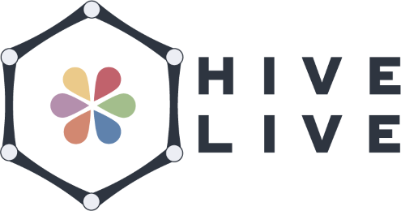

# Hive Live website repo

Welcome to the official repository of the [HiveLive Universe](https://hivelive.me/) website.

HiveLive is a bunch of tools for the [Hive Blockchain](https://hive.io).

## Projects

HiveLive is composed of 6 projects :

- [SuperHive](https://superhive.blog/), a Hive-based blog-engine (like WordPress but on blockchain)
- [HiveStream](https://stream.hivelive.me/), a Hive donations Integration for streamers
- [Hive PHP Lib](https://gitlab.syncad.com/hive/hive-php-lib), Enterprise-class PHP lib for Hive
- [MultiStaker](https://stake.hivelive.me/), A tool to play with Hive-Engine tokens
- [TokenDistrib](https://distrib.hivelive.me/), an automatic token disitrbutor
- [NetworkStatus](https://netstat.hivelive.me/), Hive-Engine status API

## Licences

This project is released under the GNU/GPL version 3. If you want to know more, read the [LICENCE](./LICENCE).

All the graphics resources are property of Cindy Ansion, [@achara1202 on Hive](https://peakd.com/@achara1202/).

